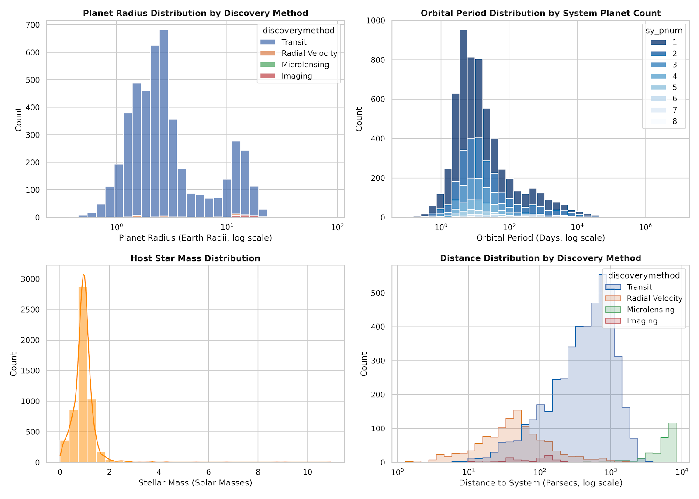
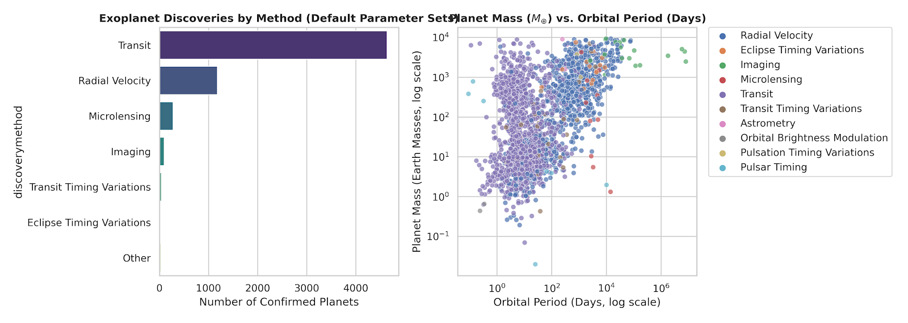
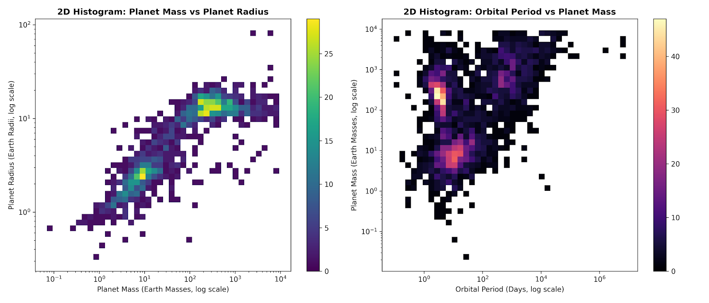
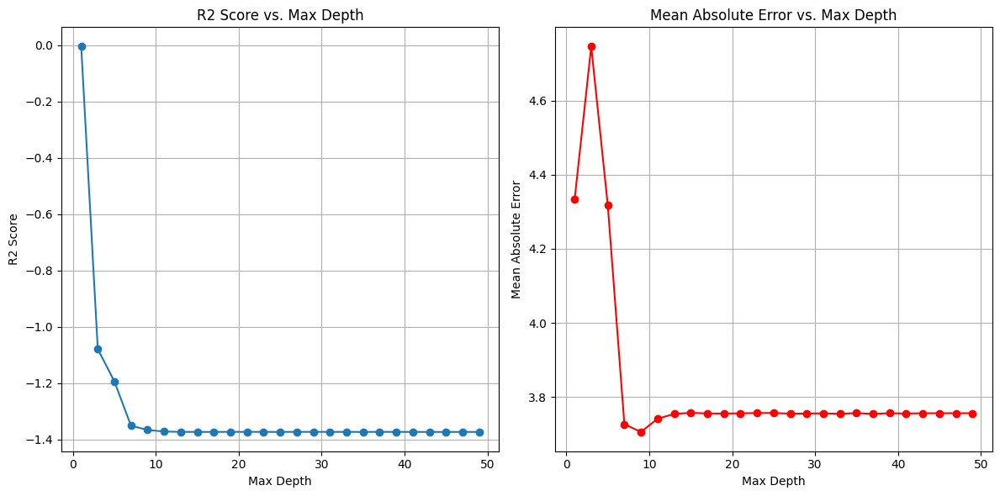
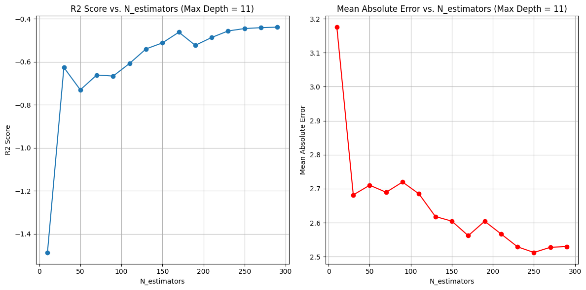
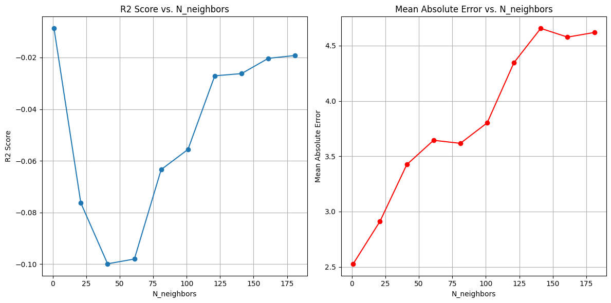

# **Project Final Paper**

## Prediction of Planetary Orbits in Binary Star Systems Using Machine Models

Aram Aghassian  
[contact me](aramig5000@gmail.com)

**Abstract:**  
When I signed up for the Inspirit AI mentorship program, I wanted to expand on the region of exoplanets, as I had done before in previous Inspirit AI programs such as the AI scholars program. In the scholars program, back in fall of last year, I had worked with a group on the same project, but after that I wanted to do something more advanced. The "problem" that I had wanted to focus on for this project was one that has been prominent for a long time in exoplanet discovery: The immense difficulty in discovering exoplanets in binary star systems. It is accepted that the majority of the stars in the universe are in binary pairs. This includes most of the neighboring stars of our galaxy. Despite this majority, astronomers have always been troubled with finding exoplanets around them, and that is simply due to their nature. Astronomers usually always target single star systems, because their means of discovering exoplanets are most efficient on them. The transit method works by observing the periodic dimming of a star each time a planet crosses in front of said star from our perspective. The only practical limit to this method is that it only works if the plane of the subject solar system is level with our line of sight, and if the planet is large enough to cause such dimming. The radial velocity method works by measuring the periodic "wobble" of a star caused by the gravity of an orbiting planet. Then there is direct imaging of exoplanets, which only works if the planets are very large, greater or equal to the mass over Jupiter. This is also affected by the luminosity of the star as well as the planet's distance to said star. These models face issues when used for binary star systems, and it is the reason why the vast majority of discovered exoplanets revolve around binary stars or orbit one of the two stars. The radial velocity method fails to be consistent, because gravity perturbations that would normally be associated with an orbiting planet can easily be blamed on the gravity of the partner star. And the transit method has issues also because, since both stars are in motion, a consistent pattern of dimmings cannot be tracked. As a method to approach this issue, My mentor and I have cultivated a model designed to predict a possible orbit for a planet, and then determine if the orbit of said planet is stable. The model consists of two parts: a regression model to predict the orbit and a classifier model to determine its stability. The regression part of the model is not very accurate. We measured accuracy in the variables "error score" and `r2_score`. "$R^2$" refers to the $r^2$ property used to measure the accuracy of a trend line. The error score refers to the average offset, in astronomical units, our predicted orbit value was compared to the real value. On average, the error score was quite high, ranging from 2.4 to 4 astronomical units. As the project came to a close, I had realized the issues with the model that hurt its accuracy, and accepted that there wasn't much I could do about it. There simply isn't enough data on double star systems to train on. By incorporating all the exoplanets in the Nasa Exoplanet Archive, we gained more data at the expense of the shift in what answers we would get. By training on a majority of single star systems, the model would be training on system architecture that is inherently different from what we were looking for. This was the main reason as to why the model was so inaccurate.

**Introduction:**  
To return to the main research question, the main question I asked myself was: Is there a way to predict possible orbits for exoplanets in binary stars, and then look in those orbits with actual telescopes? To satisfy this question, our goal was to create a model that could predict an orbit for a possible exoplanet around one of two stars in a binary star system, and then determine if that predicted orbit was stable. This type of problem required two models: a regression model to predict an orbit, and a "yes" or "no" classifier model to determine its stability. For our data, we initially wanted to get data from only binary stars to best train our data. The type of data that we wanted would be numerical parameters of the star system such as stellar mass (for both stars, if possible), stellar semimajor axis, stellar eccentricity, and stellar orbital period. These would be factors that would influence the maximum possible stable orbit for a planet orbiting one of the two stars. In addition to this, we would also need numerical data on the planet itself. However we faced a great hindrance, as there is simply not enough data on binary systems with exoplanets to train our model on. On the NASA Exoplanet Archive, only 2,724 of the 40,106 individual rows described systems with two stars. In order to widen our dataset, we had to include star data from every star in the archive. The data in the archive is made up of numerical data which includes information on the star and planets respectively. Our final model has two different outputs. The first is a predicted semimajor axis for a possible planet, and the second is an evaluation of the stability of said semimajor axis as a yes or no statement.

**Background:**  
The paper "On the Formation of Planets in Binary Star Systems", by T. A. Heppenheimer [1] speaks on how planets could exist in binary star systems. One of the main points that the paper argues is that, generally, planet growth in binary star systems is greatly affected by the characteristics of the companion star. The stars' distance from each other can affect how often planetesimals collide with one another, as well as how energetic these collisions are (impacts with too much kinetic energy can result in complete destruction of the respective colliding bodies instead of combining into a larger mass, which is crucial for planet formation). It is also suggested that the system architecture is best when the system is arranged similarly to a Sun/Jupiter binary. Essentially, there is one larger star in the center, with a significantly less massive star orbiting it in a roughly circular orbit. Now, making our model based off of star systems in this dynamic would be inefficient, as most binary star systems are not in this ideal setup. Our model would be general for all binary system data. Most binary stars are in elliptical orbits, and the respective stars usually have similar mass characteristics. This is especially due to the fact that most stars, and therefore binary stars, consist of red dwarfs, in which the range of the difference in masses is more restrained. "The Occurrence of Wide-Orbit Planets in Binary Star Systems", by B. Zuckerman [2], showcases a new possible method to determine the frequency of planetary systems orbiting individual members of a binary star system. This method specifically revolves around binary star systems that consist of at least one white dwarf star. The photospheres of these white dwarves being polluted by elements like calcium or silicon indicates the existence of planetary debris near the star. The presence of these pollutants can be blamed on the gravitational perturbations of large planets with large semimajor axes. The system architecture is similar to what our model will predict. Instead of circumbinary exoplanets, which orbit both stars, our model is meant to focus on planets that orbit one of the two stars. This is also in line with the fact that our method of determining the stability of such orbits, the "classifier", assumes the same system architecture.

**Dataset:**  
The data set we chose to train our regression model was from the NASA Exoplanet Archive. The website allows us to download a table of all listed stars with exoplanets. The table displays each characteristic of a star system as a column from left to right. These characteristics come in both numerical data and word data. The word data includes information about the names of the planets, the name of the discovery facility, the discovery method, and the planetary parameter reference. This data would not be important to us. The numerical data is what we needed the most in order to create our model. This data has parameters such as, but not limited to, the number of stars/planets, stellar/planetary mass, stellar/planetary radius, orbital period, eccentricity, and semimajor axis. These parameters were important to us because we wanted the model to use them to predict values for the semimajor axis. Any type of pattern or relationship the model could find would be valuable. Preprocessing this data required the downloading of many Python packages such as, but not limited to, `numpy`, `seaborn`, and `pandas`. After downloading the dataset, we had to refine it to include only parameters we deemed necessary. The refined dataset consisted of much of the numerical parameters mentioned previously. The refined set consisted of the semimajor axis, planet mass, planet radius (in Earth radii), stellar radius, stellar mass, planet orbital period, and planet orbital eccentricity. To further refine the data, we removed null values across each parameter, to prevent them from messing with the regression model. However, we later found out that the NASA Exoplanet Archive already had a function to remove null values from the table, deeming the code section unnecessary. Below are frequency graphs of many of the parameters in our refined dataset. Graphing these helped us remove outliers.

  
  

Another form of processing done to the data was Winsorization. The function of Winsorization is to reduce the effects that outliers may have on the model. We applied this to both the fifth and ninety-fifth percentiles of our data. However this method would become useless as the NASA Exoplanet Archive actually has functions in order to remove such outliers.

**Methodology/Models:**  
For our regression model, we used multiple different regression models due to the fact that some may fit our data better than others. We used four, which included Linear Regression, Random Forest, KNeighbors, and MLP. The basic Linear Regression model simply fits a line onto the data, while the Random Forest works by combining the predictions of multiple decision trees to make a continuous, numerical output. KNeighbors works by finding values of the "K" (an integer value chosen by the user) most similar to data points. A MLP, or Multi-layer Perceptron model passes input data through interconnected layers of artificial neurons to predict a value. To get a sense of what model we should use, we graphed both `r2_score` and error score versus their respective parameters. We settled on the Random Forest regressor, as it had a consistent increase in `r2_score` along with a consistent decrease in error score from 3.2 astronomical units to slightly over 2.5 astronomical units. The MLP regressor had no consistent pattern whatsoever, and was completely chaotic. After this prediction, we would use a borrowed CSP stability model which would use a mathematical equation on the predicted orbit to determine if it is stable or not. Our training data was split to eighty percent of the data being used to train, and the remaining twenty percent used to test. To reduce complexity, we had the X values be of the stellar mass and planetary orbit parameters, based on how they are both related to the planet's semimajor axis.

**Results/Discussion:**  
Our model has not yielded good accuracy, and this is something I had a hard time accepting until recently. We measured the accuracy of our model using the two parameters R-squared score and error for the determined semimajor axis. R-squared score represents how well the model fits the data, and semimajor axis error represents how far off the predicted values for star systems were from their actual values in astronomical units (AU). Since we used multiple models, we got different score values. Despite this, they were still very low. Our R-squared score averaged to be massively below one percent to even negative values at some instances. The error was off consistently by four to six astronomical units. For a bit of comparison, red dwarf systems often could fit inside the orbits of the Solar system's rocky planets. For all other star systems which are larger, a four to six AU range of error is similar to the distance between Jupiter and Saturn.  

To get a better understanding of the results, we plotted them in graphs to understand how the accuracy changed as the model took in data. Below are the graphs of R-squared score vs maximum depth, and mean absolute error vs maximum depth (for the Random Forest Regressor).

  

As both graphs show, the R-squared score and error scores generally tend to start off strong, but then fall off and flatten out. We did a similar graph with the KNeighbors model (`N_neighbors` replaces `Max_Depth`), as seen below.

  

The graphs of the KNeighbors model are quite different from that of the Random Forest Regressor, in the sense that the KNeighbors R-squared and mean absolute error actually seem to improve (more significantly in mean absolute error, as R-squared score decreases from a starting point and never goes higher than it).

**Conclusion:**  
Due to my interests in astronomy, I wanted to use this research project to try to do something new, and see if it could work. I had always known about the methods of discovering exoplanets, but I had also always known that it was more difficult for binary star systems. My goal was to make a predictor that could at least somewhat assist in the search for exoplanets in binary star systems. Throughout this process, I have learned about machine models, and how different models work, such as KNeighbors and Random Forest. We could never increase the accuracy of our model, because it is simply not possible. There is simply too little data. If there were thousands of stars in binary systems, then our model would be able to find more realistic patterns for prediction. However, this is not the case. If I were to continue on this project, I would likely change the basis of my research question entirely to something that has much more data connected to it.

**Acknowledgements:**  
I would like to give my thanks to my mentor, Grant Regen. He has assisted me in concepts of Python that were more advanced than what I had known prior, especially for the Visual Studio Code that houses our final model.

**References:**

\[1\]
Heppenheimer, T. A., "On the formation of planets in binary star systems." *Astronomy and Astrophysics*, vol. 65, no. 3, EDP, pp. 421–426, 1978.  
\[2\]
Zuckerman, B., "The Occurrence of Wide-Orbit Planets In Binary Star Systems", Department of Physics and Astronomy, University of California, Los Angeles, CA 90095, USA, 2014.  
\[3\]
Heppenheimer, T. A. "Outline of a theory of planet formation in Binary Systems", *Icarus*, 22(4), pp. 436–447, 1974. doi:10.1016/0019-1035(74)90076-1.
